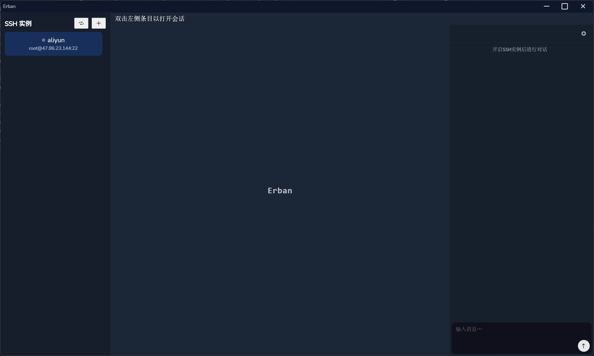
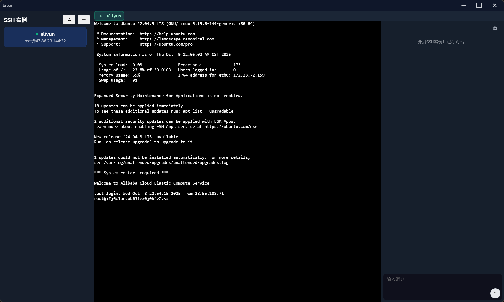
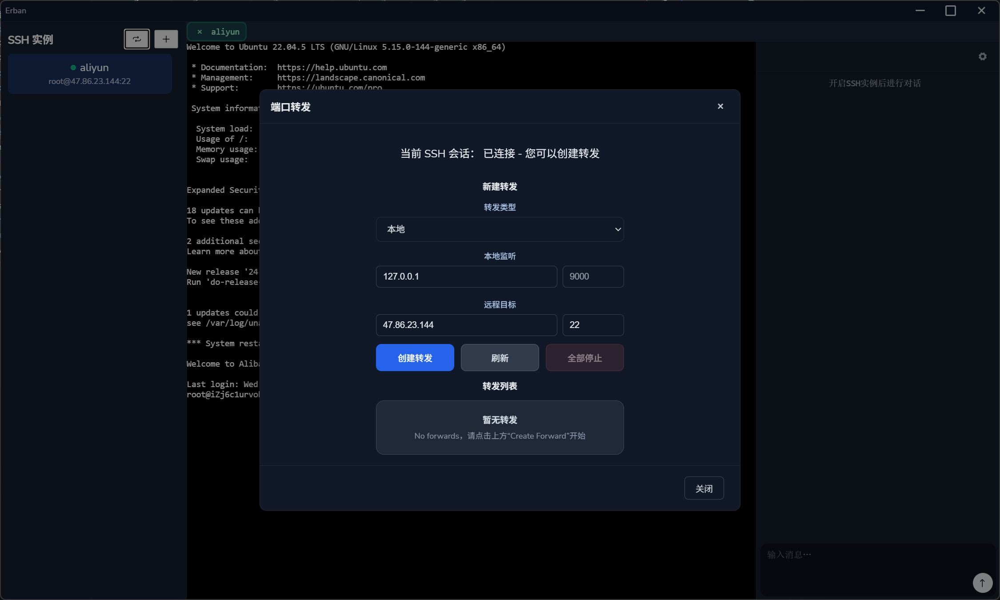
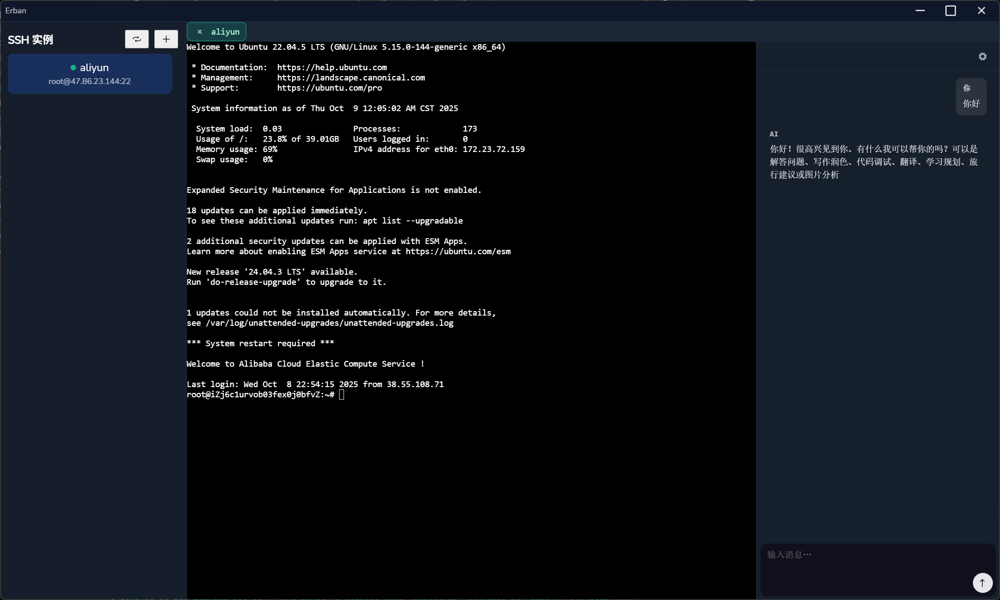

<div align="center">

# Erban

基于 Wails（Go + Vue 3 + Vite）的跨平台桌面应用，用于管理 SSH 连接、隧道转发、SFTP，同时支持多家大模型（OpenAI/Gemini/Anthropic）对话能力。

</div>

<p align="center">
  <a href="https://goreportcard.com/badge/github.com/flyingeirc/erban">
    
  </a>
</p>


<p align="center">
    
    
    
    
</p>

## 特性

- SSH 管理：一键连接/断开、会话终端、日志输出、性能监控
- SFTP 与文件操作：上传/下载、目录浏览
- 端口转发：本地/远程/socks转发与状态监控
- 代理支持：可为 SSH 连接配置 HTTP/SOCKS 代理
- AI 对话：接入 OpenAI、Gemini、Anthropic，多模型可选（可自配 Key）
- 跨平台：Wails 打包，Windows/macOS/Linux 均可构建

> [!CAUTION]
> 项目仍处于探索开发阶段，如果您有更好的想法和建议，欢迎您参与

## 路线图（Roadmap）

- [√] 隧道/端口转发（本地/远程/SOCKS）
- [√] SSH 连接与会话终端
- [√] 代理支持（SSH 可设置 HTTP(S) 代理）
- [√] AI API（OpenAI 兼容接口）
- [√] 流式输出（对话/终端输出流式显示）
- [ ] SFTP 文件管理（上传/下载、目录浏览）
- [ ] 更多API接口类型，如Gemini / Anthropic
- [ ] 性能监控
- [ ] 支持更多私钥格式
- [ ] 支持Markdown文本渲染
- [ ] 支持代码高亮
- [ ] UI 优化
- [ ] Agent 能力

## 目录结构

```
.
├── main.go                  # Wails 启动与前端资源嵌入
├── internal/
│   ├── ssh/                 # SSH 核心：connect/session/sftp/port-forward/logging
│   └── chat/                # 大模型适配层
│       ├── model/           # openai.go / gemini.go / anthropic.go / function.go
│       ├── tools/           # 工具与转换
│       └── output/          # 流式输出封装
├── frontend/                # Vue 3 + Vite + TypeScript 前端
│   ├── src/components/      # 业务组件（TerminalXterm、SshList、Modals）
│   ├── wailsjs/             # Wails 自动生成的前端桥接代码
│   └── ...
├── build/                   # 构建产物与平台配置
├── wails.json               # Wails 项目配置
├── go.mod / go.sum          # Go 依赖
└── README.md                # 项目说明
```

## 快速开始

### 环境要求

- Go 1.21+（建议）
- Node.js 18+ / pnpm 或 npm
- Wails CLI：`go install github.com/wailsapp/wails/v2/cmd/wails@latest`

### 开发模式（热重载）

```bash
wails dev
```

- 运行后，Vite 提供前端热更新，Wails 负责前后端桥接。
- 也可单独开发前端：
  - `cd frontend && npm run dev`

### 生产构建

```bash
wails build
```

- 构建好的二进制位于 `build/` 目录。

### 仅运行后端（需要已有前端构建）

```bash
cd frontend && npm run build   # 先生成 frontend/dist
cd .. && go run .              # 后端读取嵌入的前端资源
```

## 测试与静态检查

- Go 测试：`go test ./...`
- 静态检查：`go vet ./...`
- 建议提交前执行：`gofmt -s -w .`

## 前端说明

- 技术栈：Vue 3、TypeScript、Vite
- 组件：
  - `frontend/src/components/TerminalXterm.vue`：xterm 终端与后端事件桥接
  - `frontend/src/components/SshList.vue`：实例列表与选择/连接
  - `frontend/src/components/AddSshModal.vue`：新增 SSH 实例表单
  - `frontend/src/components/PortForwardModal.vue`：端口转发配置
  - `frontend/src/components/AiConfigModal.vue`：AI 模型与 Key 配置

## 后端说明（Go / Wails）

- `internal/ssh`：
  - 连接与会话管理、端口转发（`portforward.go`）、SFTP（`sftp.go`）、代理（`proxy.go`）、日志收集
- `internal/chat`：
  - 多模型适配（OpenAI/Gemini/Anthropic），统一输出流，函数调用等能力
- `main.go`：Wails 启动、桥接前端导出方法、嵌入前端静态资源

## 提交规范与 CI

- 提交信息遵循 Conventional Commits，例如：`feat(ssh): add keepalive monitor`
- 提交前建议本地验证：
  - `go vet ./...`
  - `wails build`

## 安全与发布提示

- 切勿提交任何密钥或私有证书；优先使用系统环境变量或本地 `.env`
- 发布前请移除 `go.mod` 中的本地 `replace` 指令（若有）
- 在 `.gitignore` 中忽略本地构建产物与临时文件


## 贡献与反馈

欢迎 Issue/PR！提交 PR 请包含：变更说明、关联 Issue、验证步骤与（若涉及 UI）截图/GIF。
如果你觉得这个项目有帮助，欢迎 Star 支持！
